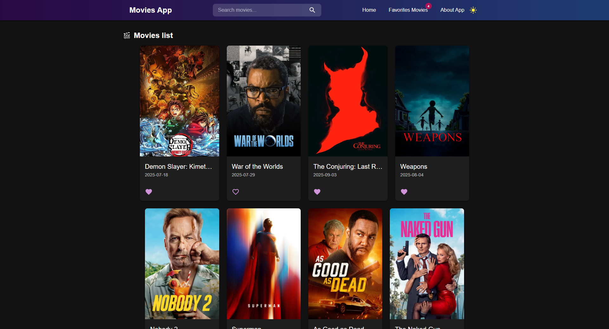

🎬 Movies App

A web application for browsing movies, viewing details, watching trailers, and saving your favorite movies with a modern and responsive design.

🚀 Features

📌 Browse Movies with posters and basic details.

🔍 Search Movies using TMDB API.

❤️ Add/Remove Favorites with data stored in Local Storage.

🎥 Movie Details Page – title, year, genre, runtime, rating, and description.

⭐ Movie Rating displayed with stars.

🌓 Dark/Light Mode with dynamic theme colors.

📱 Fully Responsive – works on mobile, tablet, and desktop.

⚡ Lazy Loading Images for better performance.

🛠️ Tech Stack

React.js ⚛️ – Frontend framework.

Redux Toolkit 🗂 – State management (favorites).

Material UI (MUI) 🎨 – Modern UI components.

TMDB API 🎥 – Movie data source.

Local Storage 💾 – Persistent favorites.

📂 Project Structure
MoviesApp/
│── src/
│   ├── components/        # UI components
│   │   ├── MovieCard.js
│   │   ├── MoviesList.js
│   │   ├── Navbar.js
│   │   └── Loader.js
│   ├── pages/             # Main pages
│   │   ├── HomePage.js
│   │   ├── MovieDetails.js
│   │   └── About.js
│   ├── slice/             # Redux slices
│   │   └── favoritesSlice.js
│   ├── App.js
│   ├── index.js
│   └── theme.js           # Dark/Light theme settings
│
└── README.md

⚙️ Installation & Setup

Clone the repository:

git clone https://github.com/username/movies-app.git

Navigate to the project folder:

cd movies-app

Install dependencies:

npm install

Run the app:

npm start

📸 Screenshots

👨‍💻 Developer

Developed by Ehab Elshahat ✨
🔗 Portfolio